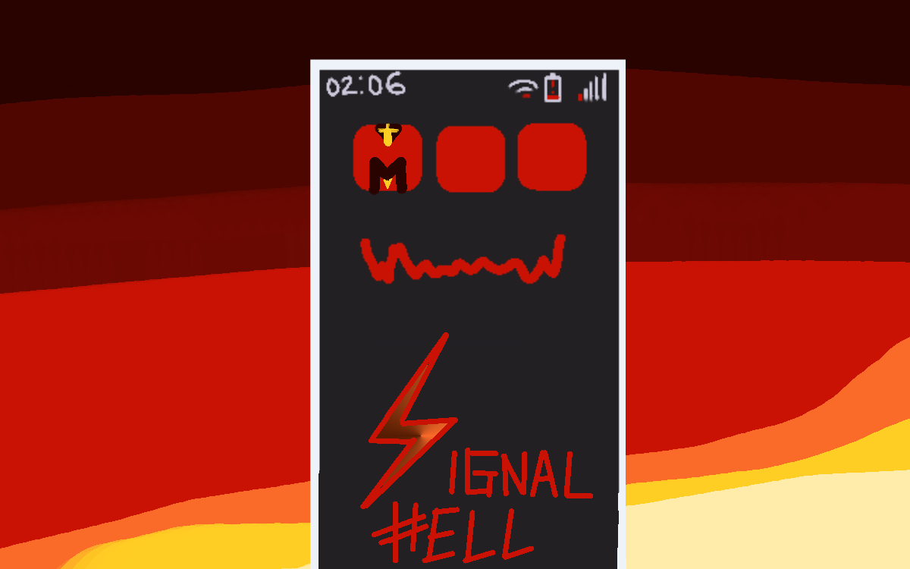

# Melvor Mod: Signal Hell (Alpha)

## Description
Welcome to Signal Hell! This mod evolved a bit from what I planned to be a mod that just added a few funny weapons. I'm still experimenting with the balance of this mod, so expect changes in the coming future.
As of right now, there are:

<ul>
	<li>4 new weapons - 2 melee and 1 of magic and ranged each.</li>
	<li>3 new dungeons of Legendary difficulty, meant to fill the gap between the Dragons Den and Volcanic Cave</li>
	<li>1 new rune, as well as 1 new attack spell</li>
	<li>4 new pets (though 1 is not yet implemented)</li>
	<li>1 new type of crossbow bolt</li>
</ul>

I plan on adding a few more weapons and spells in the future, and hopefully some armour sets.

I'm still working on balancing, and I'm wanting to add quite a bit more content as my time and energy allow. My priority right now is figuring out combat balance, as weapons and dungeons are both not where I want them to be. I also plan on editing the loot tables for the dungeon chests, as right now I'm still experimenting with drop rates.

All of the assets are drawn by me.

## In Progress:
<ul>
	<li>Tweaking Combat Stats of Enemies</li>
	<li>Assigning Modifiers</li>
	<li>Adding Descriptions</li>
	<li>Creating new Attacks and Status Conditions</li>
	<li>Creating art for various items and entities</li>
	<li>Creating new items and entities</li>
</ul>

##
#### *As with all mods, I recommend you create a backup of your saves before using this mod*
#### *Let me know if you have any questions, concerns, or suggestions. I hope you enjoy my mod :)*

*You can submit reports for any game-breaking bugs on this project's GitHub page. Please don't use this link for any reports for balance issues or anything like that, as I'm aware and working on it. Any issues of that nature can be commented down below, or you can find me on the Melvor Idle Discord. I will take any such comments into consideration as I continue development.*
